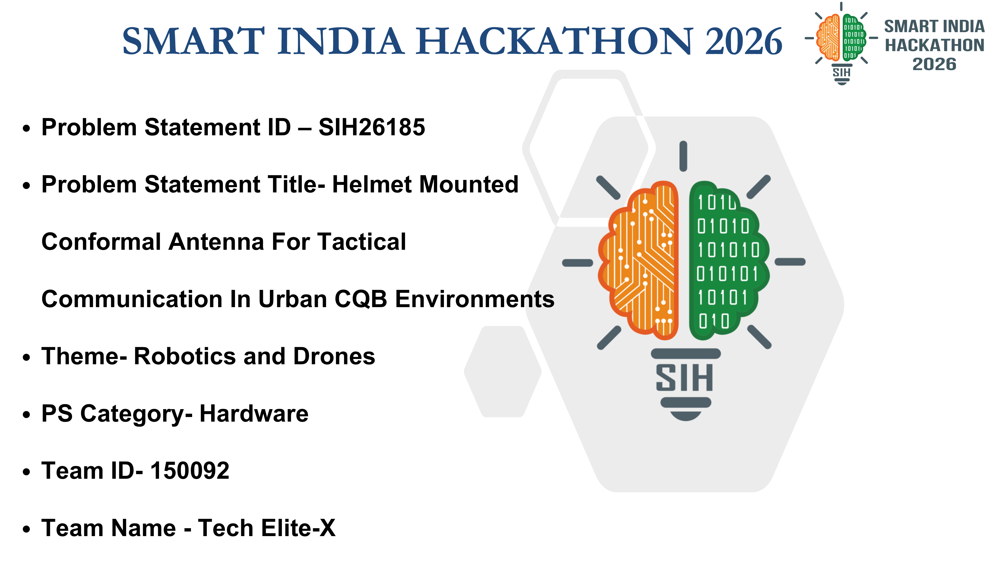
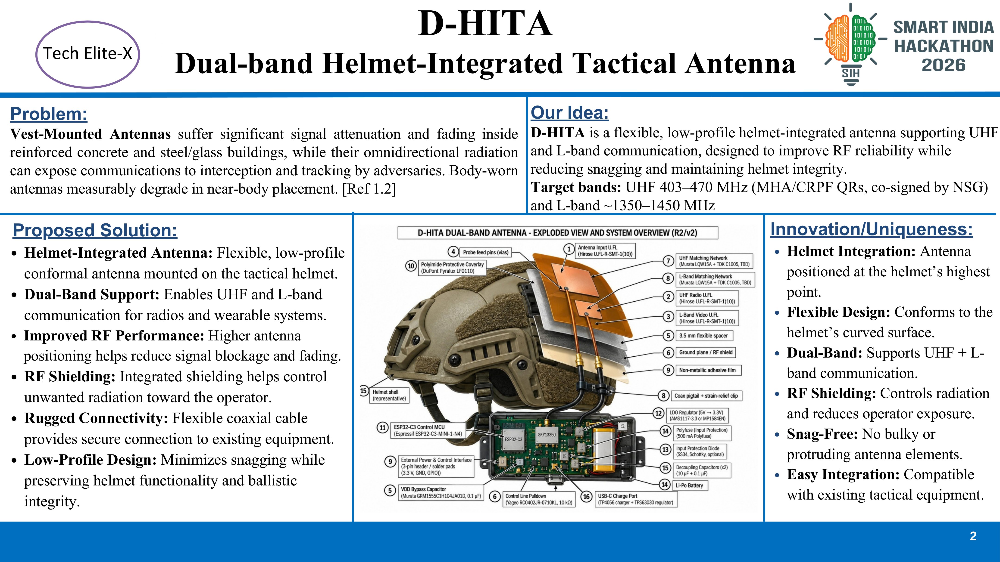
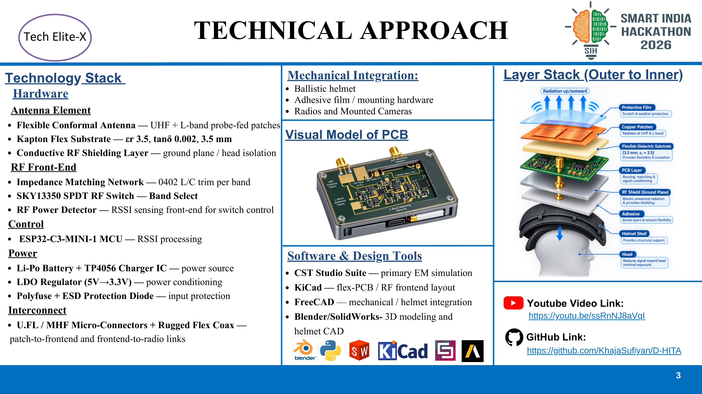
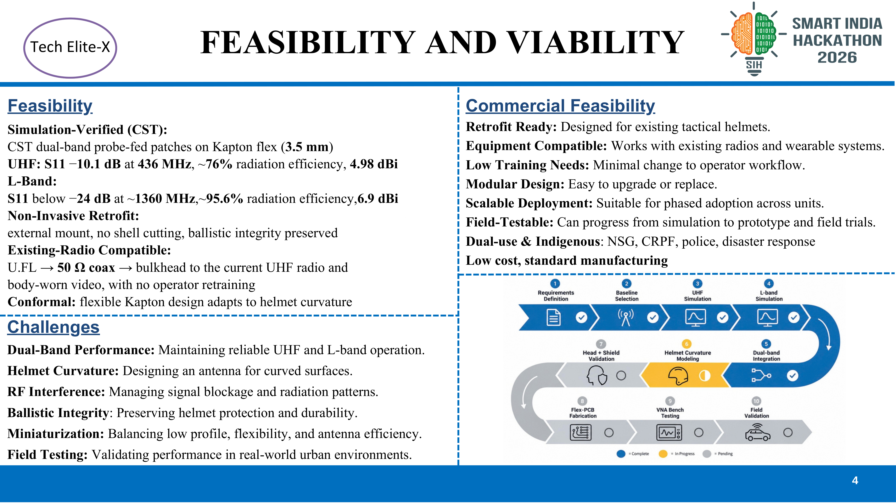
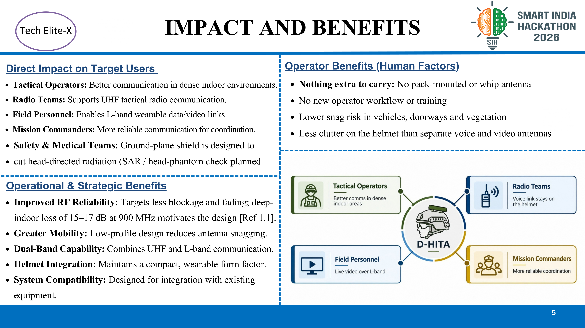
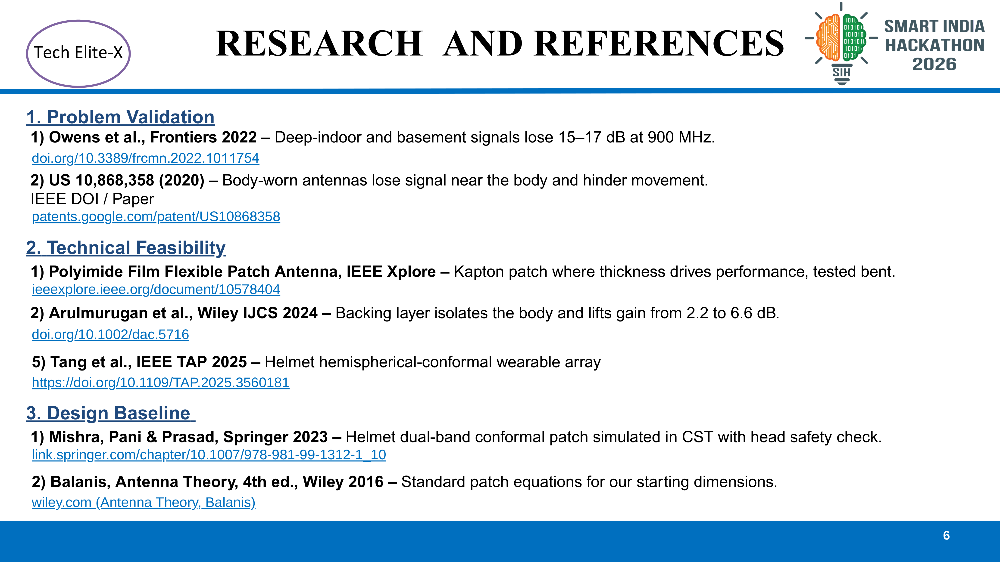

# D-HITA Presentation — Smart India Hackathon 2026

Official idea presentation deck for **SIH 2026** (Problem Statement ID: **SIH26185**).

- **Team Name:** Tech Elite-X
- **Team ID:** 150092
- **Theme:** Robotics and Drones
- **Category:** Hardware
- **Problem Statement Title:** Helmet Mounted Conformal Antenna For Tactical Communication In Urban CQB Environments
- **Video Demonstration:** [YouTube Video Link](https://youtu.be/ssRnNJ8aVqI)
- **Repository:** [GitHub Link](https://github.com/KhajaSufiyan/D-HITA)

---

## Deck Files

| Format | File Path | Description |
|---|---|---|
| **PowerPoint (.pptx)** | [`SIH2026-IDEA-Presentation-Format.pptx`](SIH2026-IDEA-Presentation-Format.pptx) | Widescreen 16:9 presentation deck with embedded links |
| **PDF (.pdf)** | [`SIH2026-IDEA-Presentation-Format.pdf`](SIH2026-IDEA-Presentation-Format.pdf) | High-resolution PDF export |
| **Slide Images** | [`slides/`](slides/) | High-resolution PNG renders for each slide (4320 × 2430) |
| **Layout Reference** | [`sih_deck_structure_reference.md`](sih_deck_structure_reference.md) | SIH presentation deck structural layout guideline |

---

## Slide Previews & Breakdown

### Slide 1: Title & Team Details

- **Event:** Smart India Hackathon 2026
- **Problem Statement ID:** SIH26185
- **Problem Statement Title:** Helmet Mounted Conformal Antenna For Tactical Communication In Urban CQB Environments
- **Theme:** Robotics and Drones
- **Category:** Hardware
- **Team ID:** 150092
- **Team Name:** Tech Elite-X

---

### Slide 2: Problem, Solution & Uniqueness

- **Problem:** Vest-mounted antennas suffer severe attenuation and fading inside reinforced concrete / steel buildings; body shadowing degrades radiation performance measurably.
- **Our Idea:** Flexible, low-profile helmet-integrated dual-band antenna supporting UHF (403–470 MHz) and L-band (~1350–1450 MHz) to maximize RF line-of-sight while eliminating snagging.
- **Proposed Solution:** Conformal mount on ballistic helmet, dual-band coverage, integrated RF shielding layer to protect the operator, rugged coaxial interconnects.
- **Innovation / Uniqueness:** Helmet apex placement, flexible curved substrate, zero snagging, no cutting of helmet shell (ballistic integrity preserved).

---

### Slide 3: Technical Approach

- **Antenna Element:** Flexible conformal patch (Kapton flex substrate $\varepsilon_r=3.5, \tan\delta=0.002, 3.5\text{ mm}$), conductive RF shielding ground plane.
- **RF Front-End:** Impedance matching network (0402 L/C trim), SKY13350 SPDT RF switch, RF power detector.
- **Control & Power:** ESP32-C3-MINI-1 MCU, Li-Po battery + TP4056 charger, 3.3V LDO regulator, ESD diode and Polyfuse protection.
- **Mechanical & Software:** CST Studio Suite (EM simulation), KiCad (RF flex layout), FreeCAD / Blender / SolidWorks (helmet 3D CAD).
- **Direct Links:**
  - YouTube: [https://youtu.be/ssRnNJ8aVqI](https://youtu.be/ssRnNJ8aVqI)
  - GitHub: [https://github.com/KhajaSufiyan/D-HITA](https://github.com/KhajaSufiyan/D-HITA)

---

### Slide 4: Feasibility and Viability

- **Simulation-Verified (CST):**
  - **UHF:** $S_{11} = -10.1\text{ dB}$ at $436\text{ MHz}$, $\sim 76\%$ radiation efficiency, $4.98\text{ dBi}$ gain.
  - **L-Band:** $S_{11} < -24\text{ dB}$ at $\sim 1360\text{ MHz}$, $\sim 95.6\%$ radiation efficiency, $6.9\text{ dBi}$ gain.
- **Commercial Feasibility:** Non-invasive retrofit for standard ballistic helmets (ACH/MICH), existing radio compatible via 50 $\Omega$ coax, zero operator retraining needed.
- **Development Roadmap:** Requirements Definition $\to$ Baseline Selection $\to$ UHF Simulation $\to$ L-band Simulation $\to$ Dual-band Integration $\to$ Helmet Curvature Modeling $\to$ Head + Shield Validation $\to$ Flex-PCB Fabrication $\to$ VNA Bench Testing $\to$ Field Validation.

---

### Slide 5: Impact and Benefits

- **Direct Impact on Target Users:** Tactical operators, radio teams, field personnel (live video over L-band), mission commanders, safety & medical teams (radiation shielded).
- **Operational & Strategic Benefits:** 15–17 dB deep-indoor loss mitigation, snag-free movement in doorways/vehicles, dual-band voice + video convergence in one wearable form factor.
- **Human Factors:** Nothing extra to carry, no pack-mounted whip antennas, less helmet clutter.

---

### Slide 6: Research and References

1. **Problem Validation:**
   - Owens et al., *Frontiers 2022* — Deep-indoor and basement signals lose 15–17 dB at 900 MHz. [doi:10.3389/frcmn.2022.1011754](https://doi.org/10.3389/frcmn.2022.1011754)
   - US Patent 10,868,358 (2020) — Body-worn antennas lose signal near the body and hinder movement. [Google Patents](https://patents.google.com/patent/US10868358) / [IEEE](https://ieeexplore.ieee.org/document/10969548)
2. **Technical Feasibility:**
   - Polyimide Film Flexible Patch Antenna, *IEEE Xplore* — Kapton patch where thickness drives performance, tested bent. [IEEE Document 10578404](https://ieeexplore.ieee.org/document/10578404)
   - Arulmurugan et al., *Wiley IJCS 2024* — Backing layer isolates the body and lifts gain from 2.2 to 6.6 dB. [doi:10.1002/dac.5716](https://doi.org/10.1002/dac.5716)
   - Tang et al., *IEEE TAP 2025* — Helmet hemispherical-conformal wearable array. [doi:10.1109/TAP.2025.3560181](https://doi.org/10.1109/TAP.2025.3560181)
3. **Design Baseline:**
   - Mishra, Pani & Prasad, *Springer 2023* — Helmet dual-band conformal patch simulated in CST with head safety check. [Springer Chapter](https://link.springer.com/chapter/10.1007/978-981-99-1312-1_10)
   - Balanis, *Antenna Theory*, 4th ed., Wiley 2016 — Standard patch equations for design dimensions.
